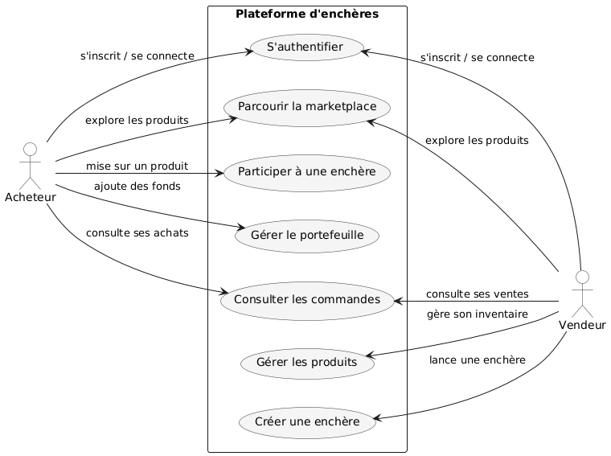

  

<i>Mandats des séances pratiques, Session Été 2026</i>

Préparé par <b>Ramy Ouabel</b> (chargé de laboratoire)

---

> Ce repo contient le mandat de la **séance courante** dans ce README, et les mandats des séances passées dans le dossier [`archives/`](./archives/).
> Vérifiez ce repo avant chaque séance.

---

# Séance 3 : Prototypage UI et Frontend

**Durée :** 1 heure
**Projet :** UniversalMarketPlace (Plateforme d'enchères)

---

## Aperçu de la séance (30 secondes)

1. **User stories** : écrire les user stories couvrant les 7 cas d'utilisation, et les regrouper sous un **milestone** dans le board.
2. **Figma** : 3 écrans (Authentification, Marketplace, Détail enchère).
3. **Choisir** un framework Frontend, l'**initialiser**, ouvrir une **PR** avec `olry` en reviewer.
4. **Documenter** dans le README : choix du framework + liste **priorisée** des microservices + **première liste de technologies** (Backend, DB, etc.) inspirée du [repo de démo](https://github.com/olry/MGL844-Demo-Microservices).
5. **Démarrer un sprint** dans votre board (fin : 20 mai 2026).

> Détails ci-dessous. Bonus optionnels en bas si vous avez le temps.

---

## À faire **avant** la séance

1. **Créer un compte Figma** (gratuit) et se connecter : https://www.figma.com
2. **Lire** le mandat du projet *UniversalMarketPlace* : [Etude_CAS_donnees.pdf](https://ena.etsmtl.ca/pluginfile.php/2535104/mod_resource/content/9/Etude_CAS_donnees.pdf) (sur ENA).
3. **Regarder** le diagramme de cas d'utilisation ci-dessous.

> Si vous ne faites pas cette préparation, vous allez perdre du temps en classe.

---

## Périmètre du projet

Le diagramme suivant définit **ce que votre équipe doit livrer** d'ici la fin du cours. C'est la version simplifiée du projet. Vous allez construire une plateforme d'enchères avec deux acteurs : **Acheteur** et **Vendeur**.

**7 cas d'utilisation à couvrir :**

| Acteur | Cas d'utilisation |
|---|---|
| Acheteur | S'authentifier, Parcourir la marketplace, Participer à une enchère, Gérer le portefeuille, Consulter les commandes |
| Vendeur | S'authentifier, Parcourir la marketplace, Consulter les commandes, Gérer les produits, Créer une enchère |

Les autres fonctionnalités du [mandat PDF](https://ena.etsmtl.ca/pluginfile.php/2535104/mod_resource/content/9/Etude_CAS_donnees.pdf) (commission, paiement bancaire externe, notifications courriel, gestionnaire d'affaires) sont **optionnelles**, seulement pour les équipes qui veulent aller plus loin.

---

## Objectifs de la séance

1. **Finaliser les user stories** et les organiser dans le board (carry-over de la séance 2).
2. **Prototyper** les écrans dans Figma.
3. **Choisir le framework Frontend** que l'équipe utilisera pour le projet.
4. **Réfléchir à la stack technologique** complète à partir du repo de démo.
5. **Diviser le travail** dans votre board et planifier un premier sprint.

---

## Minimum obligatoire (tous les étudiants)

### 1. User stories + milestone
- Écrire les **user stories** couvrant les 7 cas d'utilisation du diagramme (format conseillé : *« En tant que [acteur], je veux [action] afin de [objectif] »*).
- Créer une **issue par user story** dans le board du projet.
- Regrouper toutes ces issues sous un **milestone** dans le board (ex. *« Phase 1 : Conception »*).

> Ces user stories vont alimenter votre **rapport Phase 1** (voir [Énoncé du projet pratique sur ENA](https://ena.etsmtl.ca/)).

### 2. Figma : 3 écrans
- **Écran 1 :** *S'authentifier* (page de connexion / inscription)
- **Écran 2 :** *Parcourir la marketplace* (liste des enchères / produits)
- **Écran 3 :** *Détail d'une enchère* avec un bouton **Miser**

### 3. Choix du framework Frontend + Init + Pull Request
1. L'équipe **discute et choisit** un framework Frontend pour le projet (React, Vue, Angular, Svelte, ou autre).
2. Documenter le choix dans le **README** avec une courte justification (2 ou 3 lignes : pourquoi ce framework ?).
   - *Suggestion :* formulez la justification en lien avec les **tactiques de modificabilité** vues en cours, ex. *Split Module* (p. 18), *Encapsulate* (p. 20), *Use an intermediary* (p. 21), *Defer binding* (p. 17, tableau des tactiques). Exemple : *« React nous permet de splitter l'UI en composants encapsulés et de différer le binding via les props/state. »*
3. **Initialiser** le squelette du projet avec l'outil officiel sur une nouvelle branche :
   - React : `npx create-react-app frontend`
   - Vue : `npm create vue@latest`
   - Angular : `ng new frontend`
   - Svelte : `npm create svelte@latest frontend`
4. **Ouvrir une Pull Request** vers la branche principale du repo.
5. **Ajouter `olry` comme reviewer** sur la PR (ne pas merger avant la revue).

> Pourquoi la PR : un `.gitignore` mal configuré peut faire commit `node_modules/` et casser le repo. La revue me permet de vous donner du feedback avant le merge.

### 4. Liste **priorisée** des microservices (dans le README du repo)
- Lister les microservices identifiés, en **ordre de priorité** (le plus prioritaire en premier). Exemple :
  > Microservices prévus (par priorité) :
  > 1. `Produit` (cœur du domaine, prérequis pour tout le reste)
  > 2. `Enchère`
  > 3. `Utilisateur` (auth + profil)
  > 4. `Portefeuille`
- 1 ligne de justification par microservice est suffisante.

### 5. Réflexion sur la stack technologique
- L'équipe doit **commencer à réfléchir** aux technologies qu'elle utilisera pour la suite du projet (Backend, base de données, gateway, message queue, cache, load balancer, conteneurisation, etc.).
- **Stack recommandée** (celle utilisée dans le repo de démo) : voir [`olry/MGL844-Demo-Microservices`](https://github.com/olry/MGL844-Demo-Microservices). Cette stack vous permet de partir vite et reste alignée avec le contenu des séances suivantes.
- Si vous voulez utiliser **d'autres technologies**, c'est permis : documentez votre choix dans le README avec une courte justification.
- Pas besoin de tout décider aujourd'hui : il suffit d'avoir une **première liste préliminaire** dans le README (vous pourrez l'ajuster aux prochaines séances).

### 6. Sprint et division du travail (fortement recommandé)
- Diviser le travail dans votre **board** (Kanban créé en séance 2).
- Créer un **premier sprint** qui se termine le **mercredi 20 mai 2026**.
- À partir du milestone créé en étape 1, sélectionner les **user stories** qui rentrent dans ce sprint. Chaque membre s'attribue ses issues.

> Ce point n'est pas strictement obligatoire à finir en classe, mais **fortement recommandé** : sans sprint et sans issues, vous allez vite perdre la trace du travail à mesure que le projet grossit.

---

## Bonus (optionnel, pour aller plus loin)

Choisissez **1 seul bonus** si vous avez le temps. Ne sacrifiez pas le minimum.

- 4e écran Figma au choix :
  - *Créer une enchère* (Vendeur)
  - *Gérer le portefeuille* (Acheteur)
  - *Gérer les produits* (Vendeur)
  - *Consulter les commandes*
- Commencer à coder un premier écran dans le framework choisi (statique, données en dur).
- Brancher cet écran sur un vrai endpoint du microservice de la séance 1.
- Ajouter un cas d'utilisation hors du diagramme (ex : notifications, commission).

---

## Livrables à la fin de la séance

| Livrable | Où | Obligatoire |
|---|---|:---:|
| User stories (issues) regroupées sous un milestone | Board/Kanban du projet | Oui |
| Lien Figma (3 écrans) | README du repo Github | Oui |
| Choix du framework Frontend (avec justification) | README du repo Github | Oui |
| Init du projet framework + Pull Request avec `olry` en reviewer | Repo Github | Oui |
| Liste **priorisée** des microservices | README du repo Github | Oui |
| Première liste de technologies envisagées (Backend, DB, etc.) | README du repo Github | Oui |
| Sprint + issues dans le board (fin sprint : 20 mai 2026) | Board/Kanban du projet | Recommandé |
| Bonus (4e écran Figma, code Frontend, etc.) | README | Non |

---

## Outils recommandés

> Vous pouvez utiliser **d'autres outils** si vous préférez. L'important : que ce soit clair et partageable.

- **Figma** (gratuit) : https://www.figma.com
  - Tutoriel rapide (10 min) : https://www.figma.com/resource-library/design-basics/
- **Frameworks Frontend** (au choix) :
  - React : https://react.dev
  - Vue : https://vuejs.org
  - Angular : https://angular.io
  - Svelte : https://svelte.dev
- **Inspiration UI** :
  - https://dribbble.com (chercher "marketplace" ou "auction")

Alternatives au Figma : Penpot (open source), Sketch, Adobe XD, ou même un dessin sur papier scanné.

---

## Conseils

- **Restez simples.** Ce n'est pas un cours de design, c'est un cours d'architecture logicielle.
- **Pensez aux données** que chaque écran affiche. Ce sont les futurs endpoints de vos microservices (séance 4).
- **Attention au temps** : `npm install` peut prendre quelques minutes. Lancez la commande d'init **dès le début de la séance** pendant que vous travaillez sur Figma en parallèle.

> **Note `.gitignore`** : vérifiez votre `.gitignore` **avant** le premier commit. Sans ça, vous risquez de pousser `node_modules/` et de commit plus de **300 000 lignes** de fichiers générés. La PR sera refusée si c'est le cas.

---

## Critères de "fait" (vérification rapide)

- [ ] Les user stories sont créées comme issues, regroupées sous un milestone.
- [ ] Les 3 écrans Figma sont visibles via un lien partagé.
- [ ] Le framework Frontend choisi est documenté dans le README avec une justification.
- [ ] Le projet framework est initialisé et une PR est ouverte avec `olry` en reviewer.
- [ ] Le `.gitignore` exclut `node_modules/` et autres fichiers générés.
- [ ] Le README contient : lien Figma, framework choisi, liste priorisée des microservices, première liste de technologies envisagées.
- [ ] Un premier sprint et des issues existent dans le board (fortement recommandé).

---

## Lien avec le cours

Cette séance pratique met en application plusieurs notions du cours sur la **modificabilité** (slides Automne 2025, *La modificabilité*, prof. Ghizlane El Boussaidi). Références de pages indicatives (le titre du slide reste la référence en cas de renumérotation).

- **Prototype Figma avant le code** : concevoir une *interface flexible* avant l'implémentation, pour absorber les changements sans réécrire le code.
  - *Cf. p. 23 « Conception pour la modificabilité » (créer des interfaces flexibles) et p. 24 (prévoir des points de variation).*
- **Découpage en écrans / composants** : application directe des tactiques *Split Module* et *Encapsulate* (chaque écran isole une responsabilité).
  - *Cf. p. 17 (tableau des tactiques), p. 18 « Split Module », p. 20 « Encapsulate ».*
- **Choix du framework Frontend** : un framework moderne (React, Vue, etc.) intègre nativement la tactique *Defer Binding* (props, state, configuration) et facilite la *variation à l'exécution*.
  - *Cf. p. 17 « Defer binding » (tableau des tactiques) et p. 24 (« plusieurs patrons de conception permettent la variation à l'exécution »).*
- **PR + revue + `.gitignore` propre** : application de *« Gérer efficacement les modifications »* (gestion de configuration, contrôle des changements à travers les versions).
  - *Cf. p. 25 « Gérer efficacement les modifications » (gestion de la configuration, intégration continue).*

---

*Document préparé par **Ramy Ouabel** (chargé de laboratoire).*
