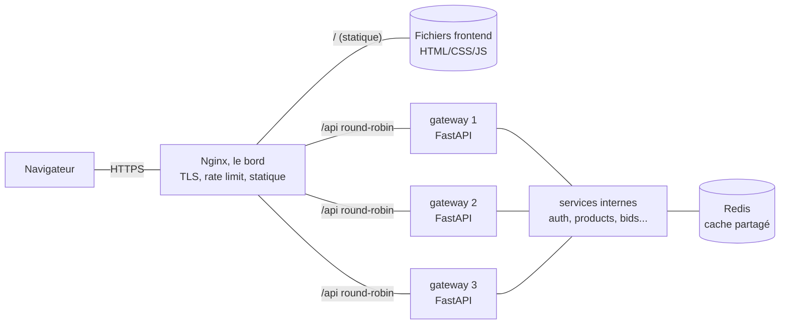

<p align="center">
  
</p>

<p align="center"><i>Mandats des séances pratiques, Session Été 2026</i></p>
<p align="center">Préparé par <b>Ramy Ouabel</b> (chargé de laboratoire)</p>

---

> Ce repo contient le mandat de la **séance courante** dans ce README, et les mandats des séances passées dans le dossier [`archives/`](./archives/).
> Vérifiez ce repo avant chaque séance.

---

# Séance 8 : Nginx, la porte d'entrée : load balancing, cache (Redis), rate limiting, statique et TLS

**Durée :** 1 heure
**Projet :** UniversalMarketPlace (Plateforme d'enchères)

---

## Aperçu de la séance

Jusqu'ici, chaque microservice tourne en **une seule instance**, et le navigateur parle directement à la gateway en **HTTP**. Cette séance place **Nginx** au **bord** du système (un *reverse proxy*) : tout le trafic entre par lui. Une fois cette porte d'entrée en place, elle prend cinq rôles, tous configurables en quelques lignes :

1. **Load balancing** : répartir les requêtes sur **plusieurs instances** d'un même service (round-robin).
2. **Servir le frontend statique** : Nginx renvoie directement le HTML/CSS/JS, sans passer par un service.
3. **TLS (HTTPS)** : le chiffrement s'arrête à Nginx ; en interne, les services restent en HTTP simple.
4. **Rate limiting** : limiter le nombre de requêtes par client pour protéger les services (anti-abus, anti-brute-force).
5. **Cache partagé (Redis)** : éviter de recalculer/relire la même donnée. Comme il y a maintenant **N instances**, le cache doit être **partagé** entre elles, et c'est le rôle de **Redis**.

> **Idée centrale.** Dès qu'on passe de *une* à *plusieurs* instances, deux questions surgissent : **« qui distribue le trafic ? »** (réponse : Nginx) et **« où vit l'état partagé, vu que chaque instance est sans mémoire ? »** (réponse : Redis). Le reste de la séance découle de là.

> **Stack libre.** Nginx et Redis sont **indépendants du langage** : ils marchent identiquement que votre backend soit en Python, Node, Java, Go ou .NET. Vous ne changez quasiment rien dans vos services ; presque tout se joue dans `nginx.conf` et `docker-compose.yml`.

---

## À faire **avant** la séance

1. Avoir un `docker compose up` qui démarre votre gateway + au moins **un** microservice métier (état de la séance 4 ou plus).
2. Avoir un frontend **buildé** en fichiers statiques (le dossier `dist/`, `build/` ou équivalent), ou au minimum un `index.html` que Nginx pourra servir.
3. Lire une fois la doc de `upstream` et `limit_req` de Nginx (5 minutes suffisent) : <https://nginx.org/en/docs/http/load_balancing.html>

---

## Objectifs de la séance

1. **Mettre Nginx au bord** du système comme unique point d'entrée (reverse proxy) devant la gateway et les services.
2. **Répartir la charge** sur plusieurs instances d'un service et **prouver** que les requêtes alternent entre instances.
3. **Servir le frontend statique** directement par Nginx, et router le reste (`/api`) vers le backend.
4. **Terminer le TLS** au bord : exposer le site en **HTTPS** (certificat auto-signé pour le labo).
5. **Limiter le débit** par client (rate limiting) sur au moins une route sensible.
6. **Introduire Redis** comme **cache partagé** entre les instances d'un service, et démontrer un *cache hit*.

---

## Le problème : une seule instance, ça ne suffit plus

Avec une seule instance par service :

- **Goulot d'étranglement** : un seul processus encaisse toute la charge. À pic de trafic (fin d'enchère, beaucoup d'acheteurs en même temps), il sature.
- **Point unique de défaillance (SPOF)** : si l'instance tombe, le service est **totalement** indisponible.
- **Pas de porte d'entrée commune** : le TLS, la limitation de débit, le service des fichiers statiques sont des préoccupations **transversales** qu'on ne veut pas réécrire dans chaque microservice.

La solution : un **reverse proxy** au bord (Nginx). Il devient l'unique adresse publique, répartit la charge sur **N instances** identiques, et centralise tout ce qui est transversal.



Les **N instances sont identiques et sans état** (*stateless*) : c'est ce qui permet à Nginx d'en choisir n'importe laquelle. Tout état partagé (cache, sessions) sort des instances et va dans **Redis**.

### Nginx et votre gateway : deux couches, deux rôles

Point important pour votre projet : **vous ne supprimez pas votre gateway** (le service FastAPI de la séance 4). Nginx vient **devant** elle, il ne la remplace pas. Vous avez maintenant **deux routeurs en série**, et chacun a un rôle distinct :

| Couche | C'est quoi | Son rôle |
|---|---|---|
| **Nginx** (le bord) | de la **configuration**, pas de code | termine le TLS, sert le frontend statique, applique le rate limiting, et **répartit** la charge sur les N instances de la gateway. Préoccupations **transversales / infrastructure**. |
| **Votre gateway** (FastAPI) | **votre code** (séance 4) | connaît vos services (sa table de routage), route `/{service}/...` vers le bon microservice, vérifie le JWT (séance 6), logique applicative. Préoccupations **métier / application**. |

Le trajet d'une requête devient : `navigateur` puis `Nginx (443, TLS)` puis `une instance de gateway (8000)` puis `le microservice interne`. Nginx ne sait pas ce qu'est un « service auth » ; il sait juste équilibrer le trafic vers `gateway`. C'est **votre gateway** qui sait que `/auth/...` part vers `auth-service`.

> Pourquoi deux couches plutôt que tout mettre dans la gateway ? Parce que le TLS, le service de fichiers statiques et le rate limiting sont des problèmes **d'infrastructure**, réglés en quelques lignes de config Nginx (et bien plus vite qu'en Python). On garde la gateway pour la **logique applicative** (routage par service, auth) et on sort l'infra vers Nginx. C'est de la **séparation des responsabilités**.

> **Routage du préfixe :** avec `location /api/` et `proxy_pass http://backend/;` (slash final), Nginx **retire** le `/api`. Une requête `/api/auth/login` arrive à votre gateway comme `/auth/login`, soit exactement le format `/{service}/{path}` qu'elle attend déjà. Vous n'avez **rien à changer** dans le code de la gateway.

---

## Minimum obligatoire (toutes les équipes)

> Les six points ci-dessous sont volontairement **petits**. Chacun se fait en quelques lignes de config. Visez « ça marche et je peux le démontrer », pas la config de production.

### 1. Nginx au bord, dans `docker compose`

- Un service `nginx` (image officielle `nginx:alpine`) démarre avec le reste via `docker compose up`.
- Il est le **seul** à publier un port vers l'extérieur (ex. `80` et `443`). Les services backend ne sont **plus** exposés directement : on y accède **uniquement** à travers Nginx.
- La config vit dans un fichier monté en volume (ex. `./nginx/nginx.conf:/etc/nginx/nginx.conf:ro`).

### 2. Load balancing sur plusieurs instances

- Définir un bloc `upstream` listant **au moins 2** instances d'un même service.
- Lancer ces instances (via `docker compose up --scale <service>=3`, ou plusieurs entrées dans le compose).
- **Prouver la répartition** : chaque instance logue son nom/hostname à chaque requête ; en rafraîchissant, on voit les requêtes **alterner** entre instances (voir *Tests manuels*).

### 3. Servir le frontend statique par Nginx

- Le `location /` sert les fichiers statiques du frontend (`root` / `try_files`).
- Le `location /api/` fait un `proxy_pass` vers l'`upstream` backend.
- Résultat : **un seul domaine** sert l'app ET l'API, plus de problème de CORS entre frontend et backend.

### 4. TLS (HTTPS) terminé au bord

- Générer un **certificat auto-signé** pour le labo (commande fournie plus bas).
- Nginx écoute en `443 ssl` ; en interne, il parle aux services en **HTTP simple** (le chiffrement s'arrête au bord, c'est le *TLS termination*).
- Optionnel : rediriger `80` vers `443`.

### 5. Rate limiting sur une route sensible

- Déclarer une `limit_req_zone` (ex. 10 requêtes/seconde par IP).
- L'appliquer avec `limit_req` sur **au moins une** route sensible (ex. `/api/auth/login` pour freiner le brute-force, ou `/api/bids` pour limiter le spam d'enchères).
- **Prouver** : une rafale de requêtes renvoie des **`429 Too Many Requests`** au-delà de la limite.

### 6. Redis comme cache partagé

- Un service `redis` (image `redis:alpine`) dans le compose.
- **Un** service backend lit/écrit une donnée **chaude** dans Redis (ex. le détail d'un produit / d'une enchère) :
  - À la lecture : si **cache hit**, on renvoie depuis Redis ; si **cache miss**, on lit la base, on met en cache avec un **TTL**, puis on renvoie.
  - À l'écriture (modification du produit) : **invalider** la clé (`DEL`) pour ne pas servir une donnée périmée.
- **Prouver** : la 1ʳᵉ requête logue `cache_miss`, les suivantes `cache_hit` (jusqu'à expiration du TTL).

---

## Exemple de référence (config illustrative)

> **Note :** le repo de démo `olry/MGL844-Demo-Microservices` sera **câblé après cette séance** (Nginx + replicas + Redis). Les extraits ci-dessous sont donc une **référence de config à adapter**, pas encore du code qui tourne dans la démo. Le principe est volontairement identique quelle que soit votre stack.

### `nginx.conf` : les cinq rôles réunis

```nginx
events {}

http {
    # --- Rate limiting : zone "auth", 10 req/s par IP ---
    limit_req_zone $binary_remote_addr zone=auth:10m rate=10r/s;

    # --- Load balancing : les instances du backend ---
    upstream backend {
        server gateway:8000;        # avec --scale, Docker résout le nom DNS
        # round-robin par défaut ; voir "Notes" pour least_conn, etc.
    }

    # --- Redirige le HTTP vers HTTPS (optionnel) ---
    server {
        listen 80;
        return 301 https://$host$request_uri;
    }

    server {
        listen 443 ssl;
        ssl_certificate     /etc/nginx/certs/server.crt;
        ssl_certificate_key /etc/nginx/certs/server.key;

        # 3. Frontend statique
        location / {
            root /usr/share/nginx/html;
            try_files $uri $uri/ /index.html;   # SPA fallback
        }

        # 2. + 4. API proxifiée et load-balancée (TLS terminé ici, HTTP en interne)
        location /api/ {
            proxy_pass http://backend/;
            proxy_set_header Host $host;
            proxy_set_header X-Forwarded-For $proxy_add_x_forwarded_for;
        }

        # 5. Rate limiting appliqué à la route sensible
        location /api/auth/login {
            limit_req zone=auth burst=20 nodelay;   # au-delà, renvoie 429
            proxy_pass http://backend/auth/login;
        }
    }
}
```

### Le `docker-compose.yml` (extrait)

```yaml
services:
  nginx:
    image: nginx:alpine
    ports:
      - "80:80"
      - "443:443"
    volumes:
      - ./nginx/nginx.conf:/etc/nginx/nginx.conf:ro
      - ./nginx/certs:/etc/nginx/certs:ro
      - ./frontend/dist:/usr/share/nginx/html:ro   # le frontend buildé
    depends_on:
      - gateway

  redis:
    image: redis:alpine
    # pas de port publié : seuls les services internes y accèdent

  gateway:
    # ... plus de "ports:" exposé vers l'extérieur ; on passe par Nginx
    environment:
      REDIS_URL: "redis://redis:6379"   # jamais en dur dans le code
```

> Pour lancer plusieurs instances de la gateway : `docker compose up --scale gateway=3`. Nginx résout `gateway` en DNS et alterne entre les conteneurs.

### Cache Redis côté service (pseudocode, à adapter à votre langage)

```python
async def get_product(product_id: int):
    key = f"product:{product_id}"
    cached = await redis.get(key)
    if cached:
        log.info("cache_hit", key=key)          # déjà en cache
        return json.loads(cached)

    log.info("cache_miss", key=key)             # première lecture
    product = await db.fetch_product(product_id)
    await redis.set(key, json.dumps(product), ex=60)   # TTL 60 s
    return product

async def update_product(product_id: int, data):
    await db.update_product(product_id, data)
    await redis.delete(f"product:{product_id}")  # invalidation : on ne sert plus le périmé
```

### Générer un certificat auto-signé (labo uniquement)

```bash
mkdir -p nginx/certs
openssl req -x509 -newkey rsa:2048 -nodes -days 365 \
  -keyout nginx/certs/server.key -out nginx/certs/server.crt \
  -subj "/CN=localhost"
```

> Le navigateur affichera un **avertissement de sécurité** (certificat non signé par une autorité) : c'est normal en labo, on clique « continuer ». En production on utiliserait **Let's Encrypt**.

### Clients Redis selon la stack

| Stack | Client Redis |
|---|---|
| Python | [`redis`](https://pypi.org/project/redis/) (`redis.asyncio`) |
| Node.js | [`ioredis`](https://www.npmjs.com/package/ioredis) ou [`redis`](https://www.npmjs.com/package/redis) |
| Java/Spring | `spring-data-redis` (Lettuce) |
| Go | [`go-redis`](https://github.com/redis/go-redis) |
| .NET | `StackExchange.Redis` |

---

## Tests manuels

Nginx démarré (`docker compose up -d`), avec la gateway scalée à 3 :

```bash
docker compose up -d --scale gateway=3
```

**1. Load balancing : voir les requêtes alterner :**

```bash
# Chaque instance logue son hostname. En répétant, le conteneur qui répond change.
for i in 1 2 3 4 5 6; do curl -sk https://localhost/api/hello/health; echo; done
docker compose logs gateway | grep -i hostname   # 3 conteneurs différents servent à tour de rôle
```

**2. Frontend statique servi par Nginx :**

```bash
curl -sk https://localhost/        # renvoie l'index.html du frontend, pas un service
```

**3. TLS actif :**

```bash
curl -skv https://localhost/ 2>&1 | grep -i "SSL connection"   # la connexion est chiffrée
# (-k : on accepte le certificat auto-signé du labo)
```

**4. Rate limiting : déclencher des 429 :**

```bash
# Une rafale dépasse la limite ; Nginx répond 429 au-delà du seuil.
for i in $(seq 1 50); do curl -sk -o /dev/null -w "%{http_code}\n" \
  -X POST https://localhost/api/auth/login -d '{}'; done | sort | uniq -c
# On doit voir un mélange de 200/401 puis des 429.
```

**5. Cache Redis : hit après le premier appel :**

```bash
curl -sk https://localhost/api/products/1   # 1er appel : cache_miss
curl -sk https://localhost/api/products/1   # 2e appel  : cache_hit
docker compose logs <service> | grep -E "cache_(hit|miss)"
```

---

## Pièges classiques

- **Exposer encore les services en direct** : après cette séance, **seul Nginx** publie des ports. Si on peut encore taper `localhost:8000` directement, le bord ne sert à rien.
- **Adresse de Redis / des upstreams en dur** dans le code : toujours via variable d'environnement (`REDIS_URL`) et via les **noms de services Docker** dans `nginx.conf`.
- **Instances avec état local** : si une instance garde des sessions/du cache **en mémoire**, le load balancing casse (une requête sur deux « oublie » l'utilisateur). L'état partagé va dans **Redis**.
- **Oublier d'invalider le cache** : après une écriture, si on ne fait pas `DEL`, on sert une donnée **périmée** jusqu'à l'expiration du TTL.
- **TTL infini** : toujours mettre un **TTL** sur les clés de cache, sinon Redis se remplit et garde du périmé indéfiniment.
- **`burst` mal compris** : `limit_req` sans `burst` rejette dès le premier dépassement ; `burst` autorise une petite file. Trop bas, des faux positifs ; trop haut, la limite ne sert plus à rien.
- **Chemins TLS introuvables** : si `ssl_certificate` pointe vers un fichier non monté, Nginx **refuse de démarrer**. Vérifiez les volumes `certs`.
- **`proxy_pass` et le slash final** : `proxy_pass http://backend/;` (avec `/`) réécrit le préfixe ; sans `/`, il le conserve. Une erreur ici donne des 404 silencieux.

---

## Notes pour aller plus loin (optionnel)

> Rien ici n'est exigé pour la séance. Ce sont les sujets à connaître pour la démo finale et pour répondre aux questions de conception.

- **Algorithmes de répartition** : round-robin (défaut), `least_conn` (vers l'instance la moins chargée), `ip_hash` (toujours la même instance pour une IP, utile pour des sessions collantes).
- **Sticky sessions vs stateless** : le vrai bon réflexe est de rendre les services **sans état** (état dans Redis/DB) plutôt que de coller un client à une instance. Le stateless est ce qui rend la **scalabilité horizontale** possible.
- **Health checks** : Nginx open-source fait du *passive health check* (il retire une instance qui renvoie des erreurs). Le check **actif** (sonder `/health` périodiquement) est dans Nginx Plus ou via un autre LB (HAProxy, Traefik).
- **Cache Nginx vs cache Redis** : Nginx sait aussi cacher des **réponses HTTP** (`proxy_cache`) au bord. Redis cache des **données applicatives** partagées entre instances. Les deux sont complémentaires ; sachez expliquer lequel résout quel problème.
- **Invalidation de cache** : « l'un des deux problèmes durs de l'informatique ». TTL court = simple mais données un peu périmées ; invalidation explicite (`DEL` à l'écriture) = frais mais plus de code. Souvent on combine les deux.
- **L4 vs L7** : Nginx fait du load balancing **L7** (il comprend HTTP : routes, en-têtes, TLS). Un LB **L4** (TCP) est plus rapide mais aveugle au contenu. Le cloud (ALB AWS, etc.) combine souvent les deux niveaux.
- **TLS en production** : **Let's Encrypt** (certbot) automatise des certificats gratuits et leur renouvellement. Le certificat auto-signé du labo n'existe que pour éviter d'installer tout ça en une heure.

---

*Document préparé par **Ramy Ouabel** (chargé de laboratoire).*
