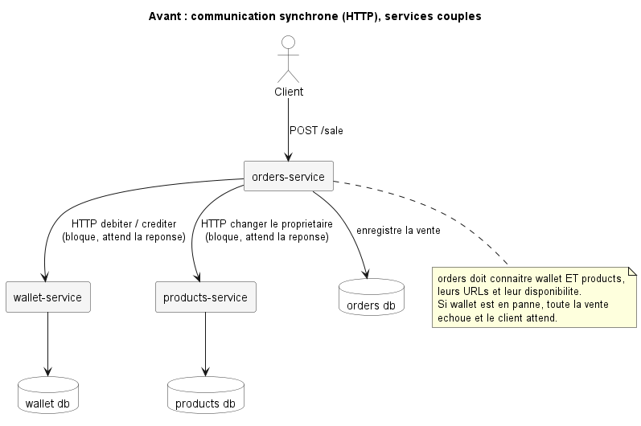
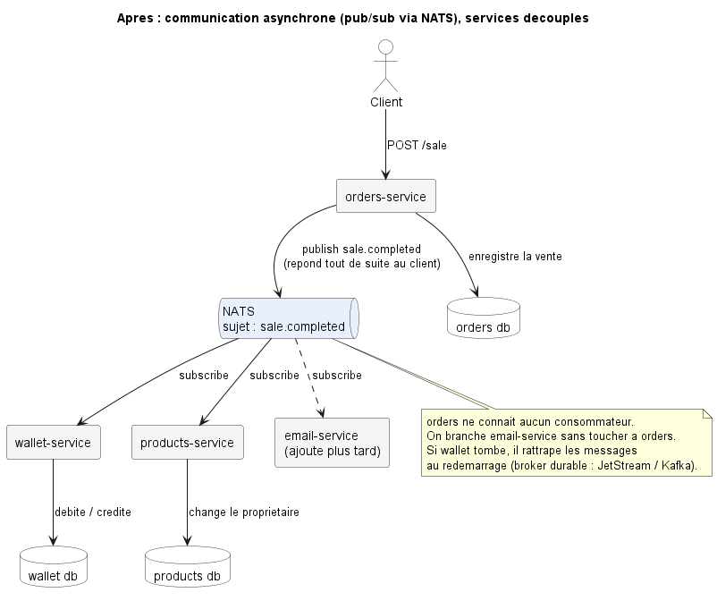

<p align="center">
  
</p>

<p align="center"><i>Mandats des séances pratiques, Session Été 2026</i></p>
<p align="center">Préparé par <b>Ramy Ouabel</b> (chargé de laboratoire)</p>

---

> Ce repo contient le mandat de la **séance courante** dans ce README, et les mandats des séances passées dans le dossier [`archives/`](./archives/).
> Vérifiez ce repo avant chaque séance.

---

# Séance 7 : Message Queue : communication asynchrone (pub/sub)

**Durée :** 1 heure
**Projet :** UniversalMarketPlace (Plateforme d'enchères)

---

## Aperçu de la séance

Cette séance introduit la communication **asynchrone** entre microservices via une **message queue**. Quatre notions à retenir :

1. **Broker de messages** : un service d'infrastructure (NATS dans la démo) qui transporte les événements.
2. **Producteur (publisher)** : un microservice qui publie un événement après une action métier (ex. `user.created`, `bid.placed`, `auction.closed`).
3. **Consommateur (subscriber)** : un autre microservice qui s'abonne au sujet et réagit (ex. crée une notification, met à jour une vue).
4. **Découplage** : le producteur n'a **pas besoin de connaître** le consommateur. On peut ajouter un nouveau consommateur sans toucher au producteur.

> **Stack libre.** Le repo de démo utilise **NATS** (`nats-py`), un broker léger qui démarre en un seul conteneur, idéal pour un labo d'une heure. Le principe **pub/sub** est le même que sur **Apache Kafka** ou **RabbitMQ** ; voyez la section *Kafka, RabbitMQ et NATS* plus bas. Vous pouvez utiliser n'importe quel broker tant que les **objectifs** sont atteints.

---

## À faire **avant** la séance

1. **Mettre à jour** le [repo de démo](https://github.com/olry/MGL844-Demo-Microservices) (le broker NATS et le flux `user.created` y sont déjà câblés) :
   ```bash
   cd MGL844-Demo-Microservices
   git pull
   docker compose up -d --build
   ```
2. **Observer le flux** en direct (voir *Tests manuels* en bas) : créez un utilisateur via la gateway, puis vérifiez qu'une **notification** apparaît dans le notification-service sans qu'aucun appel HTTP direct n'ait eu lieu entre les deux services.

---

## Objectifs de la séance

1. **Comprendre** la différence entre communication **synchrone** (HTTP) et **asynchrone** (message queue), et quand préférer l'une à l'autre.
2. **Comprendre** le modèle **pub/sub** : sujet (topic/subject), producteur, consommateur, découplage.
3. **Publier** un événement métier depuis un microservice après une action (ex. création d'une ressource).
4. **Consommer** cet événement dans un autre microservice et y **réagir** (persister, notifier, etc.).
5. **Démontrer le découplage** : les deux services ne s'appellent jamais directement en HTTP ; ils communiquent uniquement via le broker.

---

## Le problème : synchrone vs asynchrone

Jusqu'ici, vos services s'appellent en **synchrone** par HTTP : le service A appelle B et **attend** sa réponse. Tant que B n'a pas répondu, A est bloqué ; si B est en panne, l'appel échoue. Les deux services sont **couplés dans le temps**.

Une **message queue** casse ce couplage : A **publie** un événement et continue tout de suite ; le broker garde le message ; les services intéressés le **consomment** chacun de leur côté, quand ils peuvent.

Prenons un cas réel de UniversalMarketPlace : un acheteur vient de gagner une enchère. Trois services sont concernés : `orders`, `wallet` (le portefeuille) et `products` (qui doit changer de propriétaire).

#### Avant : appels HTTP synchrones, services couplés

`orders` appelle `wallet` pour déplacer l'argent, attend, puis appelle `products` pour changer le propriétaire, et attend encore. Si `wallet` est en panne, toute la vente échoue, et `orders` doit connaître les deux autres services et leur disponibilité.

<p align="center">
  
</p>

Chaque service garde **sa propre base de données** (pas de base partagée), mais les flèches HTTP partent toutes de `orders` : c'est lui le point de couplage.

#### Après : événement publié sur le broker, services découplés

<p align="center">
  
</p>

`orders` publie `sale.completed` et répond au client sans attendre. `wallet` et `products` réagissent chacun de leur côté, sur leur propre base. On peut brancher un nouveau consommateur (ex. `email-service`) sans toucher à `orders`.

> Le code ci-dessous est un **pseudocode d'illustration** du scénario. Le code réel qui tourne déjà dans la démo (flux `user.created`) est plus bas, section *Exemple de référence*.

### Producteur : le service `orders` publie la vente

```python
import json
import nats

async def confirm_sale(nc, product_id: int, buyer_id: int, seller_id: int, amount: int):
    event = {
        "product_id": product_id,
        "buyer_id": buyer_id,
        "seller_id": seller_id,
        "amount": amount,
    }
    await nc.publish("sale.completed", json.dumps(event).encode())
    # orders a terminé. Il n'attend ni wallet ni products.
```

### Consommateur 1 : le service `wallet` déplace l'argent

```python
async def on_sale(msg):
    e = json.loads(msg.data)
    await debit(e["buyer_id"], e["amount"])    # on débite l'acheteur
    await credit(e["seller_id"], e["amount"])  # on crédite le vendeur

nc = await nats.connect("nats://nats:4222")
await nc.subscribe("sale.completed", cb=on_sale)
```

### Consommateur 2 : le service `products` change le propriétaire

```python
async def on_sale(msg):
    e = json.loads(msg.data)
    await set_owner(e["product_id"], e["buyer_id"])  # le produit change de mains

nc = await nats.connect("nats://nats:4222")
await nc.subscribe("sale.completed", cb=on_sale)
```

**Ce qu'on gagne :**
- **Découplage** : `orders` ignore qui consomme. Brancher un `email-service` sur `sale.completed` ne change **rien** dans `orders`.
- **Résilience** : si `wallet` est momentanément en panne, `orders` n'est pas bloqué et répond quand même au client. (Pour que `wallet` traite le message *à son retour* au lieu de le perdre, il faut un broker durable ; voir *Notes de résilience*.)
- **Scalabilité** : on peut lancer plusieurs instances d'un consommateur pour absorber la charge.

**Ce que ça coûte :**
- **Cohérence éventuelle** : pendant quelques millisecondes, l'argent a bougé mais le propriétaire du produit n'est pas encore à jour (ou l'inverse). On l'accepte en échange du découplage.
- **Débogage plus difficile** : le flux n'est plus une simple pile d'appels. Les logs structurés (séances 5 et 6) deviennent essentiels pour suivre un événement bout en bout.
- **Rattrapage des pannes** : si une étape échoue après coup, il faut une compensation (republier un événement correctif). C'est le principe des *sagas*, hors sujet pour cette séance.

> Autres bons candidats à l'asynchrone dans UniversalMarketPlace : `bid.placed` (notifier le vendeur, rafraîchir le prix) et `auction.closed` (créer la commande, notifier le gagnant).

---

## Minimum obligatoire (toutes les équipes)

### 1. Un broker de messages dans `docker compose`

- Un service broker (NATS, RabbitMQ ou Kafka) démarre avec le reste via `docker compose up`.
- Les microservices producteur et consommateur **dépendent** du broker (`depends_on`) et lisent son adresse depuis une **variable d'environnement** (`NATS_URL`, etc.), jamais en dur.

### 2. Un producteur qui publie un événement

- Après une action métier réussie (ex. `POST` qui crée une ressource), le service **publie un événement** sur un sujet nommé en `domaine.action` (ex. `user.created`, `bid.placed`).
- Le **payload** est un JSON minimal et explicite (les identifiants utiles, pas l'objet entier). Jamais de donnée sensible (mot de passe, token).
- La publication ne doit **pas casser** la réponse HTTP au client : on répond au client même si un consommateur est absent.

### 3. Un consommateur qui s'abonne et réagit

- Un **autre** microservice **s'abonne** au sujet au démarrage et **réagit** à chaque message (ex. crée une notification, met à jour une donnée locale).
- Le consommateur **ne fait aucun appel HTTP** vers le producteur : toute l'information nécessaire est dans l'événement (ou récupérée par lui-même).

### 4. Découplage démontrable

- Couper/retirer le consommateur **ne casse pas** le producteur : l'action métier (création) réussit quand même.
- Au redémarrage du consommateur, il recommence à traiter les nouveaux événements.

### 5. Logs structurés (rappel séances 5 et 6)

Chaque côté logue l'événement en **JSON** :
- Producteur : `event_published` (info) avec le sujet et l'id concerné.
- Consommateur : `event_received` (info) avec le sujet et l'id, puis le résultat du traitement.

---

## Exemple de référence (Python/FastAPI + NATS)

Le repo de démo `olry/MGL844-Demo-Microservices` câble déjà le flux `user.created` : **hello-service** publie, **notification-service** consomme. **Inspirez-vous-en pour votre stack**, ne copiez pas mécaniquement si ce n'est pas Python.

### Le broker dans `docker-compose.yml`

```yaml
nats:
  image: nats:2.10-alpine
  command: ["--http_port=8222"]   # active l'endpoint de monitoring /healthz
  ports:
    - "${NATS_PORT}:4222"          # port client
    - "${NATS_MONITOR_PORT}:8222"  # monitoring HTTP
  healthcheck:
    test: ["CMD-SHELL", "wget -q -O - http://localhost:8222/healthz | grep -q '\"status\":\"ok\"'"]
```

Les services producteur/consommateur déclarent `depends_on: { nats: { condition: service_healthy } }`.

### Connexion au broker (au démarrage, dans le `lifespan`)

```python
import nats
from contextlib import asynccontextmanager

@asynccontextmanager
async def lifespan(app: FastAPI):
    nc = await nats.connect(settings.nats_url)  # NATS_URL = nats://nats:4222
    app.state.nats = nc            # gardé pour que les routes puissent publier
    try:
        yield
    finally:
        await nc.drain()           # vide proprement avant l'arrêt
```

### Producteur : publier après l'action métier (`hello-service`, `controllers/user.py`)

```python
@router.post("", response_model=UserOut, status_code=201)
async def create(payload: UserCreate, request: Request, db: AsyncSession = Depends(get_db)):
    u = await create_user(db, payload.name)

    # NATS attend des bytes : on encode le JSON en utf-8.
    await request.app.state.nats.publish(
        "user.created",
        json.dumps({"id": u.id, "name": u.name}).encode(),
    )
    return UserOut.model_validate(u)
```

### Consommateur : s'abonner et réagir (`notification-service`, `notif_app/main.py`)

```python
# Callback appelé par NATS à chaque message reçu sur "user.created".
async def handle_user_created(msg) -> None:
    data = json.loads(msg.data)
    message = f"Bonjour {data['name']} ! (id={data['id']})"
    async with SessionLocal() as db, db.begin():
        await create_notification(db, message)

@asynccontextmanager
async def lifespan(app: FastAPI):
    nc = await nats.connect(settings.nats_url)
    await nc.subscribe("user.created", cb=handle_user_created)  # abonnement
    app.state.nats = nc
    try:
        yield
    finally:
        await nc.drain()
```

> Le callback est **isolé au niveau module** exprès : on peut le tester en unitaire (lui passer un faux `msg`) sans serveur NATS qui tourne.

---

## Kafka, RabbitMQ et NATS : même principe, échelles différentes

Le plan du cours mentionne **Apache Kafka**. La démo utilise **NATS** car il démarre en un seul conteneur léger (pas de Zookeeper/KRaft, pas d'administration de topics), adapté à une heure de labo. Le **modèle pub/sub est identique** ; comprenez les équivalences :

| Notion | NATS | Apache Kafka | RabbitMQ |
|---|---|---|---|
| Canal | *subject* (`user.created`) | *topic* (partitionné) | *exchange* + *queue* |
| Mise à l'échelle des consommateurs | *queue group* | *consumer group* (par partition) | *competing consumers* |
| Persistance / rejouabilité | mémoire (ou JetStream pour la durabilité) | log persistant, rejouable (offsets) | file persistée, accusé de réception |
| Démarrage | 1 conteneur, ~instantané | broker + KRaft/Zookeeper, plus lourd | 1 conteneur + plugin management |

> **Pour aller plus loin (théorie) :** Kafka brille quand on a besoin de **rejouer** l'historique des événements, d'un **ordre par clé** (partitions) et d'un débit très élevé. Sachez expliquer *pourquoi* à la démo finale, même si vous livrez avec NATS.

> **Side note : "Kafka peut être synchrone aussi, non ?"** En partie. Un producteur Kafka peut **bloquer** en attendant l'accusé d'écriture du broker (`future.get()`, `acks=all`), mais il attend que le **message soit écrit dans le log**, pas une réponse métier d'un autre service ; la consommation, elle, reste toujours en *pull* asynchrone. Le vrai *request/reply* (A interroge B et attend sa réponse, comme en HTTP) n'est pas natif sur Kafka. NATS, lui, l'offre nativement avec `nc.request(...)`. Retenez la vraie distinction : « synchrone vs asynchrone » porte sur le fait que **l'appelant bloque ou non pour une réponse**, ce qui est indépendant du transport (HTTP ou message queue).

### Équivalents pour les autres stacks

| Stack | NATS | Kafka | RabbitMQ (AMQP) |
|---|---|---|---|
| Node.js | [`nats`](https://www.npmjs.com/package/nats) | [`kafkajs`](https://kafka.js.org/) | [`amqplib`](https://www.npmjs.com/package/amqplib) |
| Java/Spring | `jnats` | `spring-kafka` | `spring-amqp` |
| Go | `nats.go` | `segmentio/kafka-go` | `amqp091-go` |
| .NET | `NATS.Client` | `Confluent.Kafka` | `RabbitMQ.Client` |

---

## Tests manuels

Avec le repo de démo qui tourne (`docker compose up -d`), port `8000` = gateway :

```bash
# 1. Créer un utilisateur (déclenche la publication de "user.created").
curl -X POST http://localhost:8000/hello/users \
  -H "Content-Type: application/json" \
  -d '{"name":"Alice"}'

# 2. Vérifier qu'une notification a été créée par le CONSOMMATEUR,
#    sans appel HTTP direct entre les deux services.
#    Si "Alice" apparaît ici, c'est que l'événement NATS a bien circulé.
curl http://localhost:8000/notify/notifications
```

C'est l'étape 2 qui **prouve** que l'événement a traversé le broker : `notification-service` n'a jamais appelé `hello-service`, il a seulement reçu le message `user.created`.

> **Note :** dans le repo de démo, `hello-service` et `notification-service` n'écrivent pas encore de logs structurés (seul `auth-service` le fait, depuis les séances 5 et 6). Les lignes `event_published` / `event_received` décrites au *Minimum obligatoire* sont donc **ce que vous devez ajouter** dans votre implémentation, pas ce que la démo affiche déjà. Une fois ajoutées, vous les verrez ainsi :
>
> ```bash
> docker compose logs hello-service        | grep event_published
> docker compose logs notification-service | grep event_received
> ```

**Démonstration du découplage :**

```bash
# Arrêter le consommateur, créer un utilisateur, vérifier que la création RÉUSSIT quand même.
docker compose stop notification-service
curl -X POST http://localhost:8000/hello/users -H "Content-Type: application/json" -d '{"name":"Bob"}'
# Réponse 201 : le producteur n'est pas bloqué par l'absence du consommateur.
docker compose start notification-service
```

> **À noter :** avec NATS « core » (la démo), le message envoyé pendant que le consommateur est arrêté est **perdu** : la notification de Bob n'apparaîtra pas après le redémarrage. C'est exactement ce qui justifie un broker **durable** (NATS JetStream, Kafka) quand on ne peut pas se permettre de perdre un événement.

> Selon le routage de votre gateway, les chemins exacts (`/hello/...`, `/notify/...`) peuvent différer. Adaptez aux préfixes de votre équipe.

---

## Pièges classiques

- **Adresse du broker en dur** dans le code : toujours via variable d'environnement (`NATS_URL`).
- **Publier avant que la connexion soit prête** : ouvrir la connexion au démarrage (`lifespan`), pas à chaque requête.
- **Oublier d'encoder/décoder** : NATS transporte des **bytes**. Sérialisez en JSON puis `.encode()`, et `json.loads()` à la réception.
- **Mettre tout l'objet dans l'événement** : publiez un payload minimal (ids + champs utiles), jamais de mot de passe ni de token.
- **Faire échouer la requête HTTP si la publication échoue** : l'action métier doit rester robuste ; loguez l'erreur, ne cassez pas la réponse au client.
- **Confondre asynchrone et "plus rapide partout"** : l'asynchrone introduit la **cohérence éventuelle**. À utiliser quand le couplage temporel pose problème, pas systématiquement.
- **Ne pas fermer proprement** la connexion (`drain()`/`close()`) à l'arrêt : risque de messages perdus.

---

## Notes de résilience (optionnel, pour aller plus loin)

> Rien de tout ça n'est exigé pour la séance. Ce sont les patterns à connaître si vous voulez que le système survive à une panne du broker ou à une perte de message. Utile pour la démo finale et pour répondre aux questions de conception.

**Le problème de base :** NATS « core » garde les messages **en mémoire**. Un message publié pendant qu'un consommateur est absent est **perdu**. Et si votre service publie après avoir écrit en base, mais que NATS est down à cet instant (ou que le service crashe entre les deux), la donnée existe mais l'événement ne part jamais. Les patterns ci-dessous traitent ces deux cas.

### 1. Broker durable (ne pas perdre les messages en vol)

Activez la durabilité : **NATS JetStream** ou un **topic Kafka persistant**. Le broker stocke les messages sur disque ; un consommateur qui redémarre **rattrape** ce qu'il a manqué (replay par séquence/offset). C'est le premier réflexe dès qu'un événement « ne doit pas être perdu » (paiement, transfert de propriété).

### 2. Idempotence (gérer les doublons)

Un broker durable livre « au moins une fois » : un même message peut être **relivré** (ex. crash avant l'accusé). Le consommateur doit donc être **idempotent** : mettez un `event_id` unique dans le payload et ignorez un id déjà traité (petite table de déduplication). Ainsi, recevoir `sale.completed` deux fois ne débite pas le portefeuille deux fois.

### 3. Accusé + retry avec backoff (ne pas perdre un traitement qui échoue)

Avec JetStream/Kafka, le consommateur **n'accuse (ack)** le message qu'**après** un traitement réussi. En cas d'échec, pas d'ack, donc le message est relivré. Ajoutez un **backoff** (attendre de plus en plus longtemps entre les essais) pour ne pas marteler une dépendance déjà en difficulté.

### 4. Dead letter (isoler les messages « poison »)

Un message qui échoue indéfiniment (donnée corrompue, bug) bloquerait la file ou boucle sans fin. Après N tentatives, routez-le vers un sujet **« à inspecter »** (dead letter) au lieu de le perdre ou de bloquer le reste. On l'analyse à froid plus tard.

### 5. Transactional outbox (publier de façon fiable même si NATS est down)

C'est **le** pattern pour « ne jamais perdre un événement ». Au lieu d'écrire en base **puis** de publier (deux opérations qui peuvent diverger), on fait :

1. Dans **la même transaction** que la donnée métier, on écrit une ligne dans une table `outbox`.
2. Un process séparé lit l'`outbox` et publie vers le broker, puis marque la ligne comme envoyée (avec retry si NATS est down).

Résultat : l'événement est publié **si et seulement si** la transaction a été validée. Si NATS est indisponible, l'outbox accumule et rejoue dès qu'il revient.

### 6. Saga (transaction distribuée multi-services avec compensation)

Quand une opération couvre plusieurs services (débiter le portefeuille, changer le propriétaire, créer la commande), il n'existe **pas** de transaction unique. Une **saga** découpe l'opération en étapes, chacune avec une **compensation** qui annule son effet si une étape ultérieure échoue.

- **Chorégraphie** (sans chef d'orchestre) : chaque service réagit à un événement et publie le suivant. Ex. : `sale.completed`, puis `wallet` publie `funds.debited`, puis `products` publie `ownership.transferred`. Si `products` échoue, il publie `ownership.failed`, et `wallet` réagit en publiant `funds.refunded` (la compensation). Simple à câbler, mais le flux global est diffus, réparti dans plusieurs services.
- **Orchestration** (avec chef d'orchestre) : un service « saga » central pilote chaque étape et déclenche les compensations en cas d'échec. Flux explicite et facile à tracer, mais c'est un composant de plus à maintenir.

> Pour ce labo, la **chorégraphie** suffit largement (c'est déjà du pub/sub). L'orchestration et l'outbox sont des sujets de niveau « production » à mentionner, pas à implémenter.

### 7. Reconnexion côté client

Le client NATS **se reconnecte automatiquement** si le broker redémarre, et peut **tamponner** les publications en attente jusqu'à une limite. Vérifiez ce comportement dans votre librairie : au-delà de la limite, les publications échouent, et c'est là que l'outbox (point 5) prend le relais. Ne supposez jamais qu'une publication réussit toujours.

---

*Document préparé par **Ramy Ouabel** (chargé de laboratoire).*
